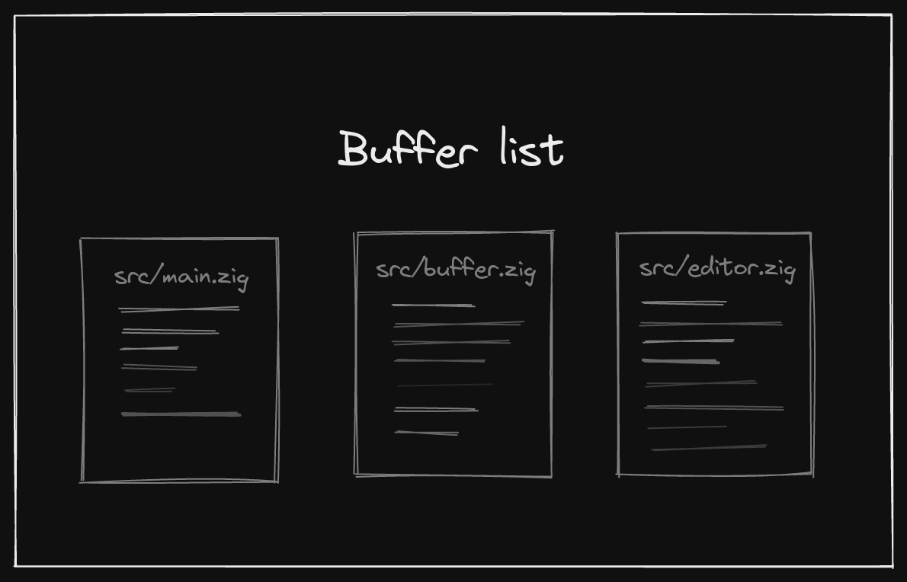
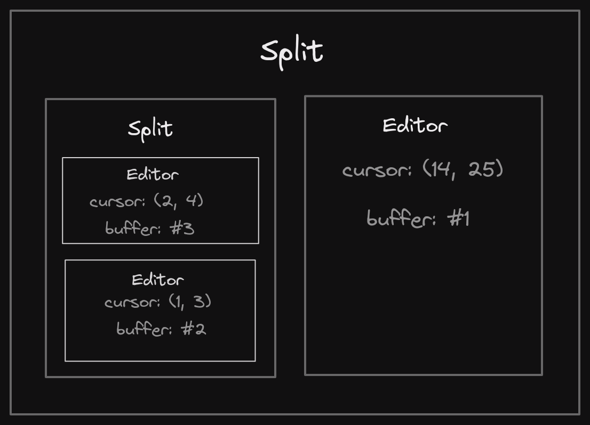

# Architecture

Limelight is based off of the many text editors that have come before it, and as such, so is it's architecture. A limelight session maintains a few lists and data structures in memory. Oftentimes, these can be manipulated by the user, so it is helpful to know and understand them.

## Buffers

Buffers are the *most* important concept to grasp within limelight. At their most basic level, a buffer stores text, and some useful data about that text. A buffer stores:

- `bytes`: the actual text
- `lang`: the language of the buffer (if applicable)
- `source`: the file name of the buffer (if applicable)
- `id`: used to keep track of the buffer

When you open a file for the first time, limelight creates a new buffer from that file, and adds it to the [buffer-list](#Buffer-list). If you subsequently try to load the same file, limelight checks the buffer list and uses that buffer instead of creating a new one.

## Buffer-list

As you may imagine, the buffer-list is a... *list of buffers* (who would've thought). It keeps track of buffers and manages them. The editor technically doesn't need a buffer-list, but without it, we'd just be throwing around a bunch of pointers (and that's no fun). Here is a nice little visualization of the buffer-list



## Editor 

An editor is an interface for users to interact with a buffer. You can have multiple editors per buffer, but you can only open one buffer at a time in a single editor. Editors store things like the current cursor position, current buffer, current selections, etc. Since multiple editors can share a single buffer, if you make a change within one editor, all editors which share that buffer will also update.

## Window

A window is a container of an editor. Windows are the only thing so far that is inherintly graphical. Windows are responsible for drawing their content (the editor). They communicate with editors to turn keyboard input into commands. Windows bridge the gap between the core layer (buffers, editors, etc) and the view layer (rendering, graphics, etc).

## Split

A split is a group of multiple windows, grouped in a specific manner. They define the structure of windows. In functional programming, a simplified `Split` might be represented like this:

```haskell
type Split
  = EditorView Editor
  | VerticalSplit Split Split
  | HorizontalSplit Split Split
```

The actual representation stores more information about window sizing and other things, but this is useful for visualization. Speaking of visuals, here's one of splits:



## Application

At the top level, handling everything mentioned above, is the `App` or application. It stores all the state, like the [splits](#Split), the [buffer-list](#Buffer-list), etc. The application layer interfaces with `SDL` to create actual windows (not to be confused with limelight's [windows](#Window)). It processes input, directing it to the proper places. It ties everything else together.

